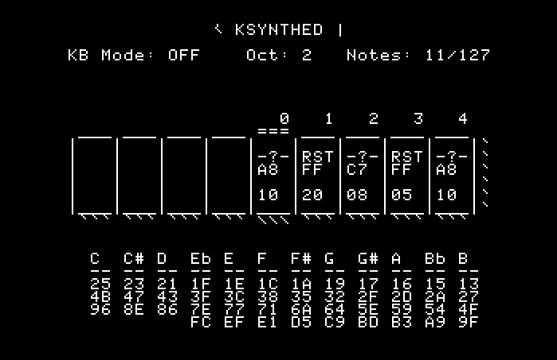

# KSYNTHED
A synthesizer and music editor program for the Apple II.  Also with player libraries.



# Usage
This is intended for use on an Apple II or emulator.  The images provided are built with ProDOS 2.4.1 installed and should be bootable on any emulator, or you can transfer them to a 3.5" or 5.25" disk using ADT Pro or to a Flash Storage device like the CFFA 3000.

If you just want the program, the latest disk images are

   [KSYNTH800.po](https://github.com/digarok/ksynthed/blob/master/KSYNTH800.po?raw=true "KSYNTH800.po")

   [KSYNTH140.po](https://github.com/digarok/ksynthed/blob/master/KSYNTH140.po?raw=true "KSYNTH140.po")

The disk should boot into ProDOS and launch the KSYNTHED editor.  Help is provided in the program in the form of built-in docs.  Access the help by pressing "H" or "?" keys.

The songs themselves are stored in a simple format where a note consists of two bytes, one for duration, and one for frequency (delay).  You can read more about the format at the project this was forked from [https://github.com/option8/ksynth](https://github.com/option8/ksynth)

However, I've also added a nice little library that you can use to make it easier to call from AppleSoft BASIC.  You load the BASIC version and then use CALL to play songs (or notes).

```BASIC
10 PRINT CHR$(4)"BLOAD KSYNTHBAS,A$300"  : REM A$ SHOULDN'T BE NEEDED
20 PRINT CHR$(4)"BLOAD MYSONG,A$4000"    : REM LOAD WHEREVER NEEDED
30 CALL 768,1,16384                      : REM SETSONG 16384 = $4000
REM NOW YOU CAN PLAY THE SONG BY CALLING PLAYSONG LIKE THIS...
40 CALL 768,2                            : REM PLAYSONG
```

# Build
You can build it yourself using the *make_bootable* Bash script under Linux or OSX.  It should be trivial to write an approximate BAT or Powershell for Windows, if that is what you are using.  Note - You need to edit the following lines in the *make_bootable* script:

    # SET THESE TOOLS UP ON YOUR SYSTEM AND UPDATE THE PATHS HERE TO BUILD
    CADIUS="../tools/Cadius"
    MERLIN="../tools/Merlin32_v1.0/MacOSX/Merlin32"

You will obviously also need those two tools on your system.  They are available here:

[Merlin32 - 65c816 Assembler](http://brutaldeluxe.fr/products/crossdevtools/merlin/index.html "Merlin32 ")

[CADIUS - Command line disk image tool](http://brutaldeluxe.fr/products/crossdevtools/cadius/index.html "CADIUS")

Again, see the manual at the top for the full description of the software and usage.  
